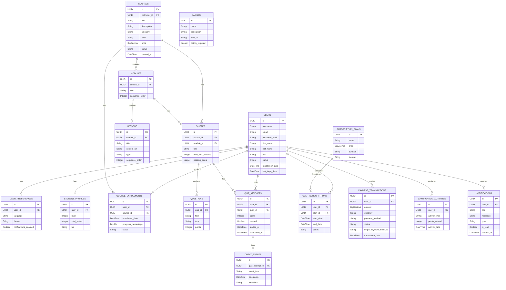

# Fahmak Alena ER Diagram

Here is a visual representation of the core database schema for **Fahmak Alena**.

```mermaid
erDiagram
    USERS {
        UUID id PK
        String username
        String email
        String password_hash
        String first_name
        String last_name
        String role
        String status
        DateTime registration_date
        DateTime last_login_date
    }

    USER_PREFERENCES {
        UUID id PK
        UUID user_id FK
        String language
        String theme
        Boolean notifications_enabled
    }

    STUDENT_PROFILES {
        UUID id PK
        UUID user_id FK
        Integer level
        Integer total_points
        String bio
    }

    COURSES {
        UUID id PK
        UUID instructor_id FK
        String title
        String description
        String category
        String level
        BigDecimal price
        String status
        DateTime created_at
    }

    MODULES {
        UUID id PK
        UUID course_id FK
        String title
        Integer sequence_order
    }

    LESSONS {
        UUID id PK
        UUID module_id FK
        String title
        String content_url
        String type
        Integer sequence_order
    }

    COURSE_ENROLLMENTS {
        UUID id PK
        UUID user_id FK
        UUID course_id FK
        DateTime enrollment_date
        Double progress_percentage
        String status
    }

    QUIZZES {
        UUID id PK
        UUID course_id FK
        UUID module_id FK
        String title
        Integer time_limit_minutes
        Integer passing_score
    }

    QUESTIONS {
        UUID id PK
        UUID quiz_id FK
        String text
        String type
        Integer points
    }

    QUIZ_ATTEMPTS {
        UUID id PK
        UUID user_id FK
        UUID quiz_id FK
        Integer score
        Boolean passed
        DateTime started_at
        DateTime completed_at
    }

    SUBSCRIPTION_PLANS {
        UUID id PK
        String name
        BigDecimal price
        String duration
        String features
    }

    USER_SUBSCRIPTIONS {
        UUID id PK
        UUID user_id FK
        UUID plan_id FK
        DateTime start_date
        DateTime end_date
        String status
    }

    PAYMENT_TRANSACTIONS {
        UUID id PK
        UUID user_id FK
        BigDecimal amount
        String currency
        String payment_method
        String status
        String stripe_payment_intent_id
        DateTime transaction_date
    }

    BADGES {
        UUID id PK
        String name
        String description
        String icon_url
        Integer points_required
    }

    GAMIFICATION_ACTIVITIES {
        UUID id PK
        UUID user_id FK
        String activity_type
        Integer points_earned
        DateTime activity_date
    }

    NOTIFICATIONS {
        UUID id PK
        UUID user_id FK
        String title
        String message
        String type
        Boolean is_read
        DateTime created_at
    }

    CHEAT_EVENTS {
        UUID id PK
        UUID quiz_attempt_id FK
        String event_type
        DateTime timestamp
        String metadata
    }

    %% Relationships
    USERS ||--o| USER_PREFERENCES : "has"
    USERS ||--o| STUDENT_PROFILES : "has"
    USERS ||--o{ COURSE_ENROLLMENTS : "enrolls in"
    USERS ||--o{ QUIZ_ATTEMPTS : "takes"
    USERS ||--o{ USER_SUBSCRIPTIONS : "subscribes"
    USERS ||--o{ PAYMENT_TRANSACTIONS : "makes"
    USERS ||--o{ GAMIFICATION_ACTIVITIES : "performs"
    USERS ||--o{ NOTIFICATIONS : "receives"
    
    COURSES ||--o{ MODULES : "contains"
    MODULES ||--o{ LESSONS : "contains"
    COURSES ||--o{ QUIZZES : "has"
    MODULES ||--o{ QUIZZES : "has"
    COURSES ||--o{ COURSE_ENROLLMENTS : "has"
    
    QUIZZES ||--o{ QUESTIONS : "contains"
    QUIZZES ||--o{ QUIZ_ATTEMPTS : "has"
    
    QUIZ_ATTEMPTS ||--o{ CHEAT_EVENTS : "logs"
    
    SUBSCRIPTION_PLANS ||--o{ USER_SUBSCRIPTIONS : "bought as"

```
